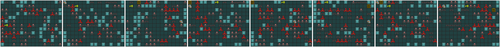
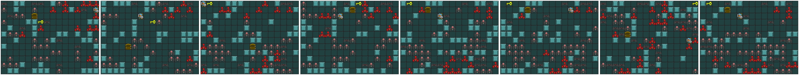

# Modified Generative Playing Networks: Agent-Discriminator GAN
Original implementation adopted from [Generative Playing Networks](https://github.com/pbontrager/GenerativePlayingNetworks)


# Install

* Python 3
* [PyTorch](http://pytorch.org/)
* [GVGAI GYM](https://github.com/rubenrtorrado/GVGAI_GYM/tree/ascii)
* [Pytorch-A2C-PPO-ACKTR-GAIL](https://github.com/ikostrikov/pytorch-a2c-ppo-acktr-gail)

In order to install requirements, follow:

```bash
#Most requirements
pip install -e .

# PyTorch
conda install pytorch torchvision -c soumith

# GVGAI GYM (Game Environments)
git clone https://github.com/rubenrtorrado/GVGAI_GYM.git
cd GVGAI_GYM
git checkout ascii
pip install -e .

# RL Library and dependency
git clone https://github.com/openai/baselines.git
cd baselines
pip install -e .

git clone https://github.com/ikostrikov/pytorch-a2c-ppo-acktr-gail.git
cd pytorch-a2c-ppo-acktr-gail
pip install -e .
```


## Sample Output
Without Agent-Discriminator structure


With Agent-Discriminator structure



## Notes of Disclaimer
This repository was built over a distributed model with the MIT License. There is no intention to make profit out of this work.


The files modified from the original network are:
```bash
trainer.py (lines 234-249)
run.py (identical to paper_run.py from original, adjusted step and added discriminator)
models/discriminator.py (entire file)
agents/agent.py (lines 426-437)
```


## Trained models
The models are too large to upload to Github, so links to Google Drive is provided as follows.


* [A-D model](https://drive.google.com/file/d/1iT1K6Slb2O2NrW_pb-02s_Q5HnNppKWd/view?usp=sharing)


Recorded data for previous runs can be found in the ```runs``` directory. It supports Tensorboard for scalars and images.
